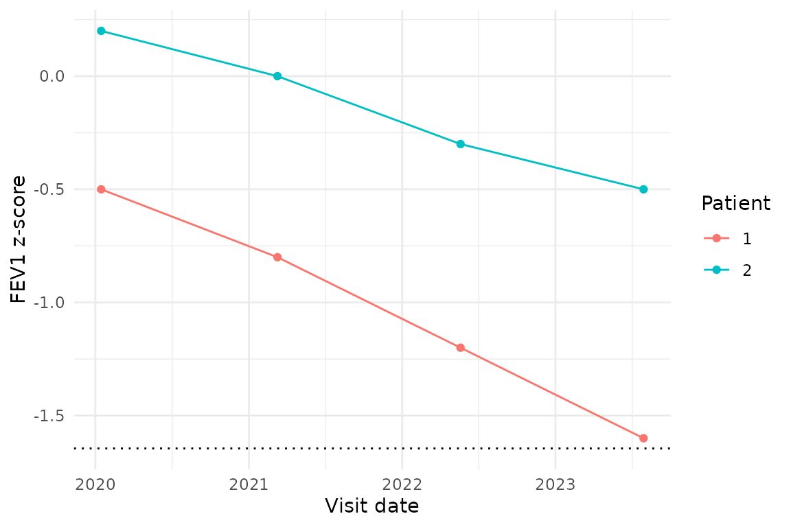

# Longitudinal PFT analysis: change and FEV1Q

PFTs are often interpreted serially rather than from a single result.
`pft` provides two PFT-specific tools defined by the Stanojevic 2022
standard that operate on serial measurements:

| Tool | Use case | Inputs |
|----|----|----|
| [`pft_change()`](https://overdodactyl.github.io/pft/reference/pft_change.md) | Two-point conditional change z-score (Stanojevic 2022 Box 2) | Two FEV1 z-scores + age + elapsed time |
| [`pft_fev1q()`](https://overdodactyl.github.io/pft/reference/pft_fev1q.md) | Stanojevic 2022 Box 3 FEV1Q ratio; the standard’s recommended alternative to CCS in adults | FEV1 (litres) + sex |

For multi-point trajectory fitting (slopes, mixed-effects models,
disease-specific decline thresholds), use the right tool for the job
directly — [`stats::lm()`](https://rdrr.io/r/stats/lm.html),
`lme4::lmer()`, or any of the general-purpose longitudinal-modelling
packages. Those decisions depend on cohort design, covariates, and
nesting structure in ways that don’t generalise into a one-size-fits-all
PFT wrapper.

## 1. Two-point conditional change score: `pft_change()`

[`pft_change()`](https://overdodactyl.github.io/pft/reference/pft_change.md)
evaluates whether the change between *two* FEV1 z-scores is larger than
expected from within-subject variability and regression to the mean. The
formula (Box 2 of Stanojevic 2022):

``` math
\text{CCS} = \frac{z_2 - r \cdot z_1}{\sqrt{1 - r^2}}, \quad
r = 0.642 - 0.04 \cdot \text{time}_\text{years} + 0.020 \cdot \text{age}_\text{years}.
```

`|CCS| > 1.96` is the two-sided 95 % significance threshold:

``` r

# Box 2 worked example: 14-year-old male, FEV1 z dropped from -0.78
# to -1.60 over 3 months.
pft_change(z1 = -0.78, z2 = -1.60, age_t1 = 14, time_years = 0.25)
#> # A tibble: 1 × 3
#>     ccs r_used is_significant
#>   <dbl>  <dbl> <lgl>         
#> 1 -2.17  0.912 TRUE
```

The same drop spread over four years is not significant – the
autocorrelation falls, so the same z-score change is more readily
explained by noise:

``` r

pft_change(z1 = -0.78, z2 = -1.60, age_t1 = 14, time_years = 4)
#> # A tibble: 1 × 3
#>     ccs r_used is_significant
#>   <dbl>  <dbl> <lgl>         
#> 1 -1.55  0.762 FALSE
```

**Scope.** The formula was derived in a pediatric / young-adult cohort;
the standard notes it has “yet to be validated, extended to adults” but
allows it as “a reasonable tool to facilitate interpretation”. For
adults the standard recommends FEV1Q instead (Box 3); see section 2
below.

## 2. FEV1Q in adults: `pft_fev1q()`

For *adults*, the 2022 standard recommends FEV1Q over the conditional
change score (Box 3). FEV1Q is the ratio of FEV1 to a sex-specific
denominator (0.5 L for males, 0.4 L for females – the 1st percentile of
the adult lung-disease FEV1 distribution per Box 3). It is not a change
score; it expresses FEV1 in absolute terms relative to that denominator,
on a scale that’s comparable across patients and over time.

``` r

# Box 3 worked example: 70-year-old female with FEV1 = 0.9 L.
pft_fev1q(fev1 = 0.9, sex = "F", age = 70)
#> [1] 2.25
```

The function refuses age \< 18 by returning `NA_real_` per the paper’s
“not appropriate for children and adolescents” caveat. See Stanojevic
2022 Box 3 for the source standard’s interpretation of the resulting
ratio.

## 3. Plotting trajectories

[`pft_plot()`](https://overdodactyl.github.io/pft/reference/pft_plot.md)
itself only produces single-patient lollipop figures. For longitudinal
trajectories, pipe a long-form
[`pft_long()`](https://overdodactyl.github.io/pft/reference/pft_long.md)
(or hand-built) table into `ggplot2` directly:

``` r

library(ggplot2)
serial <- data.frame(
  patient_id  = rep(1:2, each = 4),
  visit_date  = rep(as.Date(c("2020-01-15","2021-03-10",
                               "2022-05-20","2023-07-30")), 2),
  fev1_zscore_2022 = c(-0.5, -0.8, -1.2, -1.6,
                   0.2,  0.0, -0.3, -0.5)
)
ggplot(serial, aes(visit_date, fev1_zscore_2022,
                   colour = factor(patient_id), group = patient_id)) +
  geom_hline(yintercept = -1.645, linetype = "dotted") +
  geom_line() + geom_point() +
  labs(x = "Visit date", y = "FEV1 z-score", colour = "Patient") +
  theme_minimal()
```



## See also

- [`vignette("interpretation-guide")`](https://overdodactyl.github.io/pft/articles/interpretation-guide.md)
  – severity bands, pattern decision tree, 2022 vs 2005.
- [`vignette("diffusion-capacity")`](https://overdodactyl.github.io/pft/articles/diffusion-capacity.md)
  – DLCO interpretation and Hb correction.
- [`?pft_change`](https://overdodactyl.github.io/pft/reference/pft_change.md),
  [`?pft_fev1q`](https://overdodactyl.github.io/pft/reference/pft_fev1q.md)
  for the function references.
