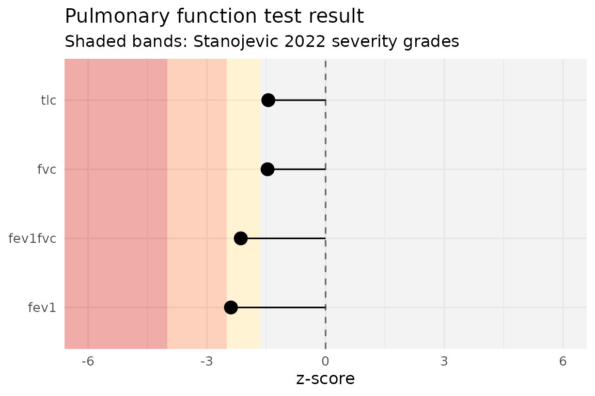

# Getting started with pft

`pft` computes reference values and routine interpretation for pulmonary
function tests: predicted values and limits of normal, z-scores, percent
predicted, ATS/ERS pattern classification, severity grading,
bronchodilator response, PRISm screening, and conditional change scores,
all from a data-frame-pipeline API. The interpretive primitives
implement the current ATS/ERS technical standard (Stanojevic et
al. 2022); the predecessor Pellegrino 2005 primitives are also available
for reclassification analyses.

The sections below run the pipeline on a single patient and then on a
small cohort.

``` r

library(pft)
#> pft 1.0.1 | Research and education use only. Not validated for diagnostic decision-making; all outputs require clinician interpretation. See citation("pft") for the source reference standards.
```

## 1. Reference values from demographics alone

The simplest call: pass age, sex, height (and race for GLI 2012) and get
predicted values, lower limits of normal (LLN), and upper limits of
normal (ULN) for every measure.

``` r

patient <- data.frame(
  sex = "M", age = 45, height = 178
)

ref <- pft_spirometry(patient)
ref[, c("fev1_pred_2022", "fev1_lln_2022", "fev1_uln_2022",
        "fvc_pred_2022",  "fvc_lln_2022",  "fvc_uln_2022")]
#> # A tibble: 1 × 6
#>   fev1_pred_2022 fev1_lln_2022 fev1_uln_2022 fvc_pred_2022 fvc_lln_2022
#>            <dbl>         <dbl>         <dbl>         <dbl>        <dbl>
#> 1           3.87          2.94          4.75          4.81         3.68
#> # ℹ 1 more variable: fvc_uln_2022 <dbl>
```

The default is GLI 2022 (“GLI Global”), the race-neutral equation set
recommended by the current ATS/ERS technical standard. To use the
predecessor GLI 2012 multi-ethnic equations, pass `year = 2012` and
include a `race` column.

The same pattern works for lung volumes and diffusion:

``` r

pft_volumes(patient)[, c("frc_pred", "tlc_pred", "rv_pred", "vc_pred")]
#> # A tibble: 1 × 4
#>   frc_pred tlc_pred rv_pred vc_pred
#>      <dbl>    <dbl>   <dbl>   <dbl>
#> 1     3.39     7.21    1.72    5.50
pft_diffusion(patient)[, c("dlco_pred", "kco_tr_pred", "va_pred")]
#> # A tibble: 1 × 3
#>   dlco_pred kco_tr_pred va_pred
#>       <dbl>       <dbl>   <dbl>
#> 1      30.3        4.58    6.67
```

## 2. Z-scores and percent predicted from measured values

Add `<measure>_measured` columns and z-scores and percent-predicted
appear automatically next to the reference values.

``` r

patient_with_measurements <- data.frame(
  sex = "M", age = 45, height = 178, race = "Caucasian",
  fev1_measured = 2.5,
  fvc_measured  = 3.8
)

out <- pft_spirometry(patient_with_measurements)
out[, c("fev1_pred_2022", "fev1_zscore_2022", "fev1_pctpred_2022",
        "fvc_pred_2022",  "fvc_zscore_2022",  "fvc_pctpred_2022")]
#> # A tibble: 1 × 6
#>   fev1_pred_2022 fev1_zscore_2022 fev1_pctpred_2022 fvc_pred_2022
#>            <dbl>            <dbl>             <dbl>         <dbl>
#> 1           3.87            -2.39              64.6          4.81
#> # ℹ 2 more variables: fvc_zscore_2022 <dbl>, fvc_pctpred_2022 <dbl>
```

The z-score uses the standard LMS formula
`((measured / M)^L - 1) / (L * S)`. Percent predicted is
`(measured / M) * 100`.

## 3. Severity grading

[`pft_severity()`](https://overdodactyl.github.io/pft/reference/pft_severity.md)
maps a z-score to one of four categories per the Stanojevic 2022 cut
points:

``` r

pft_severity(c(0, -1.7, -3, -5))
#> [1] "normal"   "mild"     "moderate" "severe"
```

You can grade any z-score column directly:

``` r

out$fev1_severity_2022 <- pft_severity(out$fev1_zscore_2022)
out$fvc_severity_2022  <- pft_severity(out$fvc_zscore_2022)
out[, c("fev1_zscore_2022", "fev1_severity_2022", "fvc_zscore_2022", "fvc_severity_2022")]
#> # A tibble: 1 × 4
#>   fev1_zscore_2022 fev1_severity_2022 fvc_zscore_2022 fvc_severity_2022
#>              <dbl> <chr>                        <dbl> <chr>            
#> 1            -2.39 mild                         -1.47 normal
```

## 4. ATS pattern classification

Given measured spirometry plus TLC and their LLNs,
[`pft_classify()`](https://overdodactyl.github.io/pft/reference/pft_classify.md)
labels the pattern per Stanojevic 2022 Figure 8:

``` r

classification_input <- data.frame(
  fev1 = 2.5,  fev1_lln_2022 = 3.0,
  fvc  = 3.8,  fvc_lln_2022  = 3.5,
  fev1fvc = 0.66, fev1fvc_lln_2022 = 0.70,
  tlc  = 6.0,  tlc_lln = 5.0
)
pft_classify(classification_input)[
  , c("ats_classification", "ats_pattern_combination")
]
#> # A tibble: 1 × 2
#>   ats_classification ats_pattern_combination
#>   <chr>              <chr>                  
#> 1 Obstructed         ANAN
```

The 4-character `ats_pattern_combination` records which inputs drove the
label (A = abnormal / below LLN, N = at or above LLN), in the order
FEV1, FVC, FEV1/FVC, TLC. `ANAN` above means FEV1 and FEV1/FVC are low;
FVC and TLC are normal.

## 5. Bronchodilator response

The Stanojevic 2022 BDR criterion is a \>10% change relative to
predicted in FEV1 or FVC (replacing the 2005 12% / 200 mL rule):

``` r

pft_bdr(pre = 2.5, post = 3.0, predicted = 4.0)
#> # A tibble: 1 × 2
#>   pct_pred_change is_significant
#>             <dbl> <lgl>         
#> 1            12.5 TRUE
```

## 6. PRISm screening

Preserved Ratio Impaired Spirometry: low FEV1 with normal FEV1/FVC.
Spirometry-only; no TLC needed.

``` r

pft_prism(data.frame(
  fev1    = 2.0,  fev1_lln_2022    = 2.5,
  fvc     = 2.6,  fvc_lln_2022     = 3.0,
  fev1fvc = 0.80, fev1fvc_lln_2022 = 0.70
))
#> # A tibble: 1 × 7
#>    fev1 fev1_lln_2022   fvc fvc_lln_2022 fev1fvc fev1fvc_lln_2022 prism
#>   <dbl>         <dbl> <dbl>        <dbl>   <dbl>            <dbl> <lgl>
#> 1     2           2.5   2.6            3     0.8              0.7 TRUE
```

## 7. Serial change

For longitudinal monitoring, the conditional change score (CCS) adjusts
for regression to the mean using a within-subject z-score
autocorrelation `r`. `|CCS| > 1.96` (the Stanojevic 2022 two-sided 95%
threshold) indicates a change outside the normal-limits range.

``` r

# z dropped from -0.5 to -2.5 over 1 year; r ≈ 0.7 for adult FEV1
pft_change(z1 = -0.5, z2 = -2.5, r = 0.7)
#> # A tibble: 1 × 3
#>     ccs r_used is_significant
#>   <dbl>  <dbl> <lgl>         
#> 1 -3.01    0.7 TRUE
```

## 8. The one-call workflow

[`pft_interpret()`](https://overdodactyl.github.io/pft/reference/pft_interpret.md)
auto-detects every available input and produces the full ATS/ERS
interpretation in one call:

``` r

patient <- data.frame(
  sex = "M", age = 45, height = 178, race = "Caucasian",
  fev1_measured     = 2.5,
  fvc_measured      = 3.8,
  fev1fvc_measured  = 2.5 / 3.8,
  tlc_measured      = 6.0,
  fev1_pre          = 2.5,
  fev1_post         = 2.9
)
result <- pft_interpret(patient)

# A high-level subset of the ~60 columns generated:
result[, c("fev1_pred_2022", "fev1_zscore_2022", "fev1_severity_2022",
           "fvc_zscore_2022", "fvc_severity_2022",
           "ats_classification", "prism",
           "fev1_bdr_pct", "fev1_bdr_significant")]
#> <pft_result>
#>  Measure     Pred  Measured Z     Severity
#>  FEV1 (2022)  3.87 -        -2.39 mild    
#> 
#> Pattern: Obstructed
#> PRISm: FALSE
#> BDR FEV1: TRUE ( 10.3% of predicted)
#> 
#> Use `as_tibble(x)` or `as.data.frame(x)` for the full output (9 columns).
```

## 9. Visualisation

[`pft_plot()`](https://overdodactyl.github.io/pft/reference/pft_plot.md)
produces a clinical-style z-score lollipop figure with severity bands.
Requires `ggplot2` (Suggests).

``` r

pft_plot(result)
```



## 10. Cohort analyses

Everything composes naturally in a pipeline. Apply
[`pft_interpret()`](https://overdodactyl.github.io/pft/reference/pft_interpret.md)
to a multi-row data frame and the output is the same data frame with ~60
interpretation columns appended:

``` r

cohort <- data.frame(
  sex    = c("M", "F", "M"),
  age    = c(45, 60, 30),
  height = c(178, 165, 175),
  race   = c("Caucasian", "AfrAm", "Caucasian"),
  fev1_measured = c(2.5, 1.8, 4.0),
  fvc_measured  = c(3.8, 2.4, 5.2),
  fev1fvc_measured = c(2.5/3.8, 1.8/2.4, 4.0/5.2),
  tlc_measured  = c(6.0, 4.5, 6.8)
)

interpreted <- pft_interpret(cohort)
interpreted[, c("sex", "age",
                "fev1_zscore_2022", "fev1_severity_2022",
                "ats_classification", "prism")]
#> # A tibble: 3 × 6
#>   sex     age fev1_zscore_2022 fev1_severity_2022 ats_classification prism
#>   <chr> <dbl>            <dbl> <chr>              <chr>              <lgl>
#> 1 M        45           -2.39  mild               Obstructed         FALSE
#> 2 F        60           -1.58  normal             Normal             FALSE
#> 3 M        30           -0.122 normal             Normal             FALSE
```

## 11. Long-form tidier for downstream analysis

[`pft_long()`](https://overdodactyl.github.io/pft/reference/pft_long.md)
pivots a wide `pft_result` into one row per `(patient, measure)`, the
natural shape for `dplyr` / `ggplot2` workflows.

``` r

pft_long(interpreted)[1:6, ]
#> # A tibble: 6 × 10
#>   .patient measure year   pred   lln   uln measured zscore pctpred severity
#>      <int> <chr>   <chr> <dbl> <dbl> <dbl>    <dbl>  <dbl>   <dbl> <chr>   
#> 1        1 fev1    2022   3.87  2.94  4.75      2.5 -2.39     64.6 mild    
#> 2        2 fev1    2022   2.47  1.77  3.12      1.8 -1.58     73.0 normal  
#> 3        3 fev1    2022   4.07  3.16  4.93      4   -0.122    98.4 normal  
#> 4        1 fvc     2022   4.81  3.68  5.95      3.8 -1.47     79.1 normal  
#> 5        2 fvc     2022   3.10  2.25  3.97      2.4 -1.36     77.4 normal  
#> 6        3 fvc     2022   4.87  3.79  5.96      5.2  0.497   107.  normal
```

The S3 method `tidy.pft_result()` dispatches to it when `broom` is
installed, so `broom::tidy(interpreted)` is identical to
`pft_long(interpreted)`.

## 12. Diffusion clinical category

When
[`pft_diffusion()`](https://overdodactyl.github.io/pft/reference/pft_diffusion.md)
outputs are available (the default in
[`pft_interpret()`](https://overdodactyl.github.io/pft/reference/pft_interpret.md)
when demographics are supplied), the Hughes & Pride 2012 categorical
interpretation falls out of `dlco_zscore`, `va_zscore`, `kco_*_zscore`:

``` r

patient_dlco <- data.frame(
  sex = "M", age = 50, height = 178, race = "Caucasian",
  dlco_measured   = 6,      # low
  va_measured     = 6,
  kco_tr_measured = 1.0     # also low -> Parenchymal pattern
)
pft_interpret(patient_dlco)$diffusion_category
#> [1] "Parenchymal"
```

## Citations

See `citation("pft")` for the package and underlying reference standards
as `bibentry` objects, suitable for direct inclusion in publications.

``` r

citation("pft")
#> Please cite the underlying reference standard for whichever function(s)
#> you use, in addition to (or instead of) the pft package itself.
#> 
#>   Johnson P, Helgeson S (2026). _pft: Reference Values and
#>   Interpretation for Pulmonary Function Tests_.
#>   doi:10.5281/zenodo.21196107
#>   <https://doi.org/10.5281/zenodo.21196107>. R package version 1.0.1,
#>   <https://CRAN.R-project.org/package=pft>.
#> 
#> GLI 2012 spirometry equations (year = 2012):
#> 
#>   Quanjer P, Stanojevic S, Cole T, et al. (2012). "Multi-ethnic
#>   reference values for spirometry for the 3-95-yr age range: the global
#>   lung function 2012 equations." _European Respiratory Journal_,
#>   *40*(6), 1324-1343. doi:10.1183/09031936.00080312
#>   <https://doi.org/10.1183/09031936.00080312>.
#> 
#> GLI Global 2022 spirometry equations (year = 2022):
#> 
#>   Bowerman C, Bhakta N, Brazzale D, et al. (2023). "A race-neutral
#>   approach to the interpretation of lung function measurements."
#>   _American Journal of Respiratory and Critical Care Medicine_,
#>   *207*(6), 768-774. doi:10.1164/rccm.202205-0963OC
#>   <https://doi.org/10.1164/rccm.202205-0963OC>.
#> 
#> GLI 2021 static lung volumes (volume_normals):
#> 
#>   Hall G, Filipow N, Ruppel G, et al. (2021). "Official ERS technical
#>   standard: Global Lung Function Initiative reference values for static
#>   lung volumes in individuals of European ancestry." _European
#>   Respiratory Journal_, *57*(3), 2000289.
#>   doi:10.1183/13993003.00289-2020
#>   <https://doi.org/10.1183/13993003.00289-2020>.
#> 
#> GLI 2017 TLCO / DLCO (diffusion_normals). Author correction (2020),
#> doi:10.1183/13993003.50010-2017, is the version implemented here:
#> 
#>   Stanojevic S, Graham B, Cooper B, et al. (2017). "Official ERS
#>   technical standards: Global Lung Function Initiative reference values
#>   for the carbon monoxide transfer factor for Caucasians." _European
#>   Respiratory Journal_, *50*(3), 1700010.
#>   doi:10.1183/13993003.00010-2017
#>   <https://doi.org/10.1183/13993003.00010-2017>.
#> 
#> Pattern interpretation algorithm (ats_classification):
#> 
#>   Stanojevic S, Kaminsky D, Miller M, et al. (2022). "ERS/ATS technical
#>   standard on interpretive strategies for routine lung function tests."
#>   _European Respiratory Journal_, *60*(1), 2101499.
#>   doi:10.1183/13993003.01499-2021
#>   <https://doi.org/10.1183/13993003.01499-2021>.
#> 
#> To see these entries in BibTeX format, use 'print(<citation>,
#> bibtex=TRUE)', 'toBibtex(.)', or set
#> 'options(citation.bibtex.max=999)'.
```
